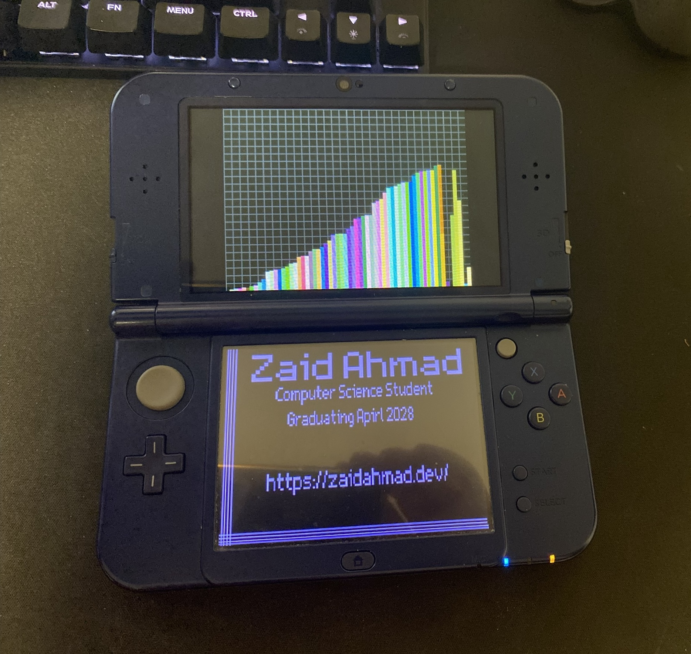

# Nintendo DS Business Card — O(n) Counting Sort Visualizer

A Nintendo DS homebrew application written in **C** that doubles as an interactive digital business card. The top screen runs a live, auto-looping **Counting Sort (O(n)) visualization** while the bottom screen displays contact and academic information.

Runs on melonDS emulator and tested on real **Nintendo 3DS XL** hardware via homebrew.

---

## Demo



| Top Screen | Bottom Screen |
|---|---|
| Animated Counting Sort bars (randomize → sort → repeat) | Static business card with contact info |

> Build the `.nds` file and open it in [melonDS](https://melonds.kuribo64.net/) to see it in action.

---

## What This Project Demonstrates

| Area | Details |
|---|---|
| **Low-level C** | Manual memory management (`malloc`/`calloc`/`free`), raw pointer arithmetic, pixel-level buffer writes |
| **Embedded graphics** | Direct VRAM writes, framebuffer mode, 8-bit paletted BG layers via `libnds` |
| **DMA transfers** | `dmaCopy` for zero-CPU-overhead blits of image data and pixel buffers to VRAM |
| **ARM9 architecture** | Cross-compiled for ARMv5TE (`arm946e-s`) targeting the Nintendo DS ARM9 core |
| **VBlank sync** | `swiWaitForVBlank()` for tear-free 60 FPS rendering |
| **Algorithm visualization** | Counting Sort implemented step-by-step with per-frame screen updates mid-sort |
| **Toolchain** | devkitARM + `libnds` + `grit` (image conversion) + GNU Make, built on Linux (WSL) |
| **Build system** | Recursive Makefile with separate ARM9 target, object file management, and asset pipeline |

---

## How It Works

### Top Screen — Sorting Visualization
1. 64 bars are randomized with random heights and colors.
2. Counting Sort runs, but pauses on **every placement** to redraw the screen — giving a smooth, step-by-step animation.
3. After sorting completes, the bars are re-randomized and the loop restarts.

The sort itself runs in O(n) time. The visual slowdown is intentional — a `swiWaitForVBlank()` call inside the sort loop forces one frame per placement, making each step visible.

### Bottom Screen — Business Card
A PNG business card image (`zaidCard.png`) is converted at build time by **grit** into an 8-bit paletted bitmap. At runtime, `dmaCopy` blits the pixel data and palette directly into sub-screen VRAM, displaying a crisp static image with no CPU overhead.

---

## Project Structure

```
DS_Business_Card/
├── Makefile               # Top-level recursive build
├── IMG_7940.jpg           # Photo of the project running on real hardware
└── arm9/
    ├── Makefile           # ARM9 devkitARM build rules
    ├── source/
    │   └── main.c         # Core application logic
    ├── include/
    │   └── font8x8_basic.h
    └── data/
        ├── zaidCard.png   # Business card image
        └── zaidCard.grit  # grit config: 8bpp paletted bitmap, 256-color palette
```

---

## Building

### Prerequisites

- [devkitPro](https://devkitpro.org/wiki/Getting_Started) with `devkitARM` and `libnds`
- `ndstool` (included with devkitPro)
- GNU Make
- Linux / WSL terminal

### Steps

```bash
git clone https://github.com/zaidahmad16/DS_Business_Card.git
cd DS_Business_Card
export DEVKITARM=/opt/devkitpro/devkitARM   # adjust to your install path
make
```

This produces `arm9/arm9.nds`. Open it in melonDS or flash it to a homebrew-enabled DS/3DS.

### Cleaning

```bash
make clean
```

---

## Running

- **Emulator:** Open the `.nds` file in [melonDS](https://melonds.kuribo64.net/)
- **Real hardware:** Copy to an SD card and launch via a homebrew loader (e.g., TWiLight Menu++) on a Nintendo DS/3DS

---

## Development Environment

| Tool | Details |
|---|---|
| OS | Ubuntu via Windows Subsystem for Linux (WSL2) |
| Compiler | devkitARM (GCC cross-compiler for ARM) |
| Graphics lib | libnds |
| Image converter | grit |
| Build tool | GNU Make |
| Test targets | melonDS emulator + Nintendo 3DS XL (homebrew) |

---

## Useful References

- [devkitPro Getting Started](https://devkitpro.org/wiki/Getting_Started)
- [libnds documentation](https://libnds.devkitpro.org/)
- [melonDS emulator](https://melonds.kuribo64.net/)
- [GRIT — GBA Raster Image Transmogrifier](https://www.coranac.com/projects/grit/)
